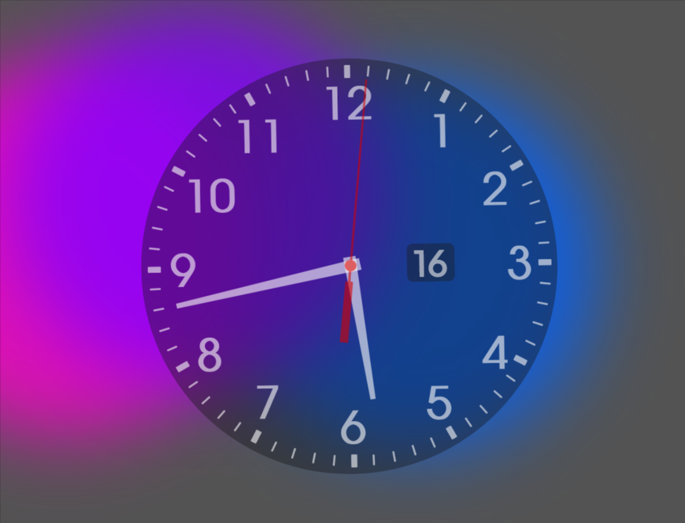
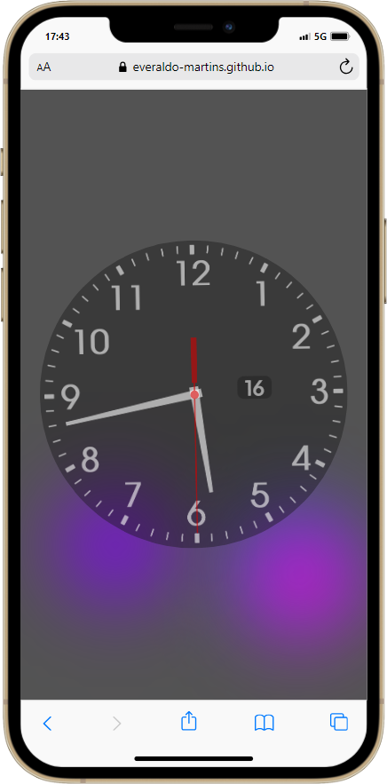

# Relógio Analógico HTML, CSS e Javascript.

## Sobre

Revitalização do projeto de férias, criado utilizando HTML, CSS, Javascript. Acrescentado efeitos visuais Booble Bouncing.

## Acesse o projeto

- [Relógio Analógico](https://everaldo-martins.github.io/Relogio_Analogico)

## Imagens

