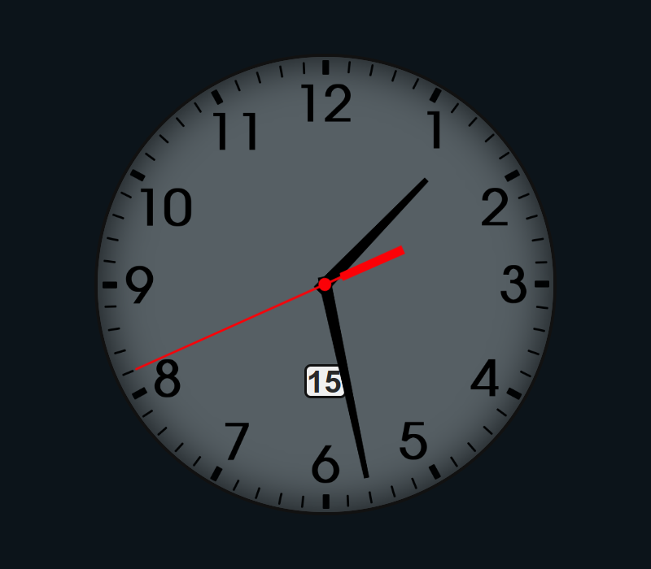
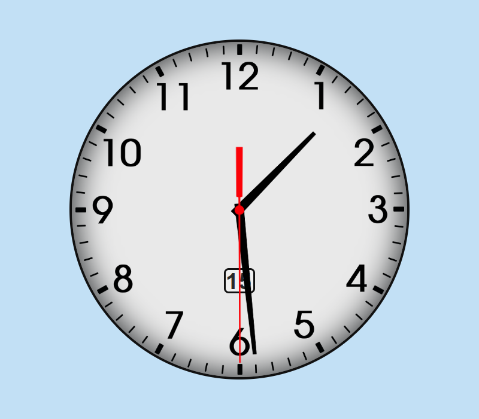

# Relógio Analógico HTML, CSS e Javascript.

## Sobre o projeto:
Projeto de férias, criado utilizando HTML, CSS, Javascript.

### Acesse o projeto em funcionamento
- <a href="https://everaldo-martins.github.io/Relogio_Analogico/" target="_blank">Relógio Analógico</a>

### Imagem do Relógio Analógico

